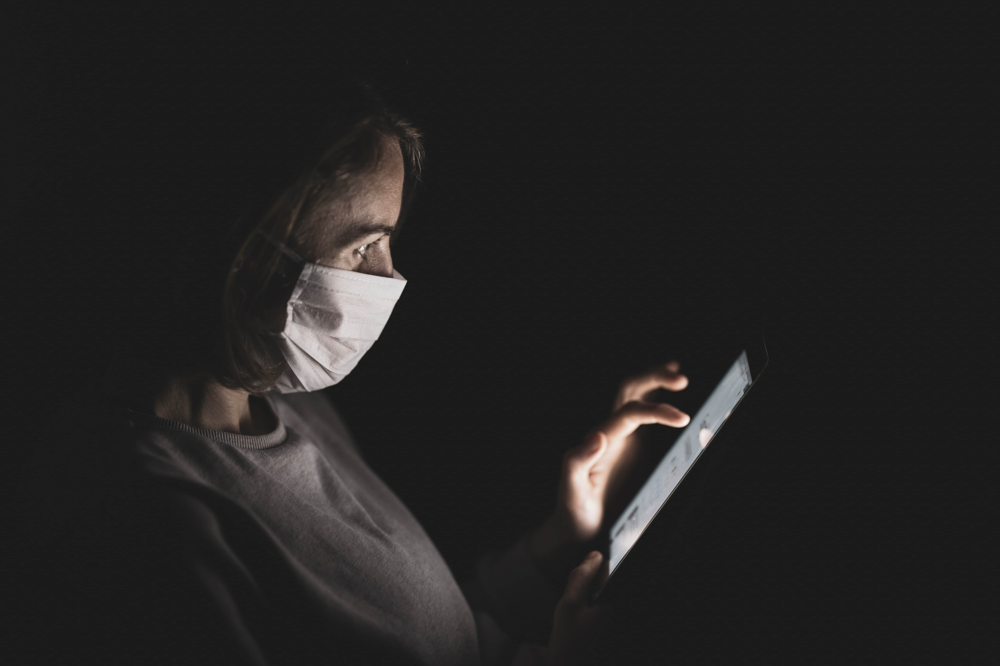

***Reportagem publicada originalmente na [Revista Digital Entreverbos](https://www.entreverbos.com.br/single-post/2020/04/30/Psic%C3%B3logos-alertam-sobre-a-sa%C3%BAde-mental-em-tempos-de-quarentena?fbclid=IwAR3BGlMoSOEn1eww2nMszjryEU0vj9Z5levLug_aVrK7G8V4EO93YKl8WFk) em 30/04/2020***

*Uso excessivo da tecnologia pode contribuir para transtornos mentais. Crédito ( Engin Akyurt/ Unsplash)*

Segundo relatório da [Organização Mundial da Saúde (OMS)](https://veja.abril.com.br/saude/os-brasileiros-sao-os-mais-ansiosos-do-mundo-segundo-a-oms/), de 2019, o Brasil é o país "mais ansioso" do mundo. Dados do órgão apontam que mais de 9% dos brasileiros, cerca de 18,6 milhões de pessoas, sofrem algum tipo de transtorno mental. Em meio ao cenário atual de quarentena, causado pelo novo coronavírus, a saúde mental é diretamente afetada com a mudança brusca que sofremos. Medidas de combate à propagação do vírus e o isolamento social fizeram milhares de brasileiros “desacelerar” das correrias do dia-a-dia, tendo que ficarem confinados em casa para o bem social e pela saúde de todos. A quarentena, o medo do vírus e a incerteza sobre quando tudo isso acabará criam um cenário de insegurança. Diante disso, profissionais da saúde mental alertam sobre os efeitos da situação no psicológico das pessoas.

De acordo com a psicóloga clínica Ana Carolina Baltazar Robes, é importante manter-se distraído e não se prender às coisas que não estão no âmbito do incerto. “Por se tratar de um momento de incerteza, o melhor a se fazer é se apegar ao que se tem de material, não necessariamente ao bem material, mas às coisas que se pode materializar, que são palpáveis”, explica Ana. Ela aponta que é possível aproveitar o momento para fazer as coisas que gosta. "Use o tempo livre para fazer outras coisas que você gosta e nunca teve tempo de fazer, aprender coisas novas, se desafiar”, completa.

Já para quem está na ativa em casa, em home office, o importante é buscar o autocontrole e a disciplina. Para Ana, é fundamental que a pessoa que esteja trabalhando em casa estabeleça uma rotina, para que isso auxilie um bom desempenho no trabalho. “A rotina é importante para o nosso organismo, e claro, para o nosso emocional também”. É um momento de adaptação, então criar horários de trabalho, de intervalos e refeições é necessário para uma boa organização. “Coloque despertadores, faça uma agenda, um quadro de planejamento”, indica a psicóloga. 

*Psicóloga clínica Ana Carolina Baltazar Robes. (crédito: arquivo pessoal)*

Outro ponto que impacta na saúde mental é o excesso de informações que recebemos constantemente devido a facilidade da tecnologia. O aspecto tecnológico como mediador das informações numa pandemia hoje é diferente do que aconteceu há 11 anos, durante o surto de H1N1, visto que, naquela época, os smartphones estavam “engatinhando” e o acesso a internet era mais limitado. Atualmente, na era da informação, as pessoas são bombardeadas por notícias o tempo todo. Ana alerta que é preciso estabelecer um filtro e saber identificar gatilhos que possam gerar ansiedade: “Se eu percebo que as notícias estão gerando em mim uma ansiedade, preocupação, medo, angústia além do minimamente confortável pra mim, se estas sensações e sentimentos, estão de alguma forma me prejudicando, devo maneirar, e digo maneirar por que não acredito que seja possível, e nem indicado a restrição completa de informações”. A psicóloga ressalta a importância de consumir informações apenas de fontes confiáveis e não absorver tudo o que vem das redes sociais, para assim evitar as fake news.

Para o psicólogo Felipe Parzianello Zampieri, a quarentena é um momento de introspecção. "É importante respeitar os sinais que nossa mente e nosso corpo nos mandam”, afirma, ao incentivar atividades positivas com o uso da tecnologia. "Realize atividades relaxantes, mantenha contato com seu círculo social através de plataformas digitais. Não se distancie de si mesmo". Já para quem está em confinamento junto com mais pessoas, o importante é manter a calma, primar pela integração e sobretudo pelo respeito. É o que aponta Zampieri. “Não há uma fórmula para que o bom convívio seja estabelecido. O meio mais próximo disso ser construído é através do diálogo, uma vez que todos estejam abertos e dispostos a falarem, mas principalmente a ouvirem”. A psicóloga Ana complementa apontando que o respeito pelo espaço do outro também auxilia no convívio saudável. “Em teoria, são pessoas diferentes confinadas na mesma casa (alô BBB), tendo que conviver mais do que o que normalmente convivem, então é importante cada um estabelecer o seu espaço, que não precisa ser físico, e cabe ao outro, ou outros, respeitar”

## Se atente aos sinais

No último surto de coronavírus, a Sars (síndrome respiratória aguda grave) que ocorreu entre 2002 e 2003, de acordo com dados da [revista East Asian Arch Psychiatry](https://www1.folha.uol.com.br/equilibrioesaude/2020/02/quase-metade-dos-sobreviventes-do-ultimo-coronavirus-teve-transtornos-mentais.shtml), quase metade dos sobreviventes (42%) apresentou transtornos mentais como ansiedade, depressão e estresse pós-traumático. É certo que em momentos de crise da saúde pública, as pessoas fiquem abaladas psicologicamente. Ana salienta que não podemos subestimar os efeitos a curto e longo prazo de uma situação como essa. “A partir do momento que seu dia a dia, sua rotina, sua capacidade de julgamento claro começam a sofrer prejuízos, a irritabilidade aumenta, assim como a falta de foco, a sensação de tristeza, significa que algo está errado, e que possivelmente seja passada a hora de procurar ajuda”, conclui Ana.

No entanto, o psicólogo Felipe alerta que o processo de análise psicológica é muito profundo, e, portanto devem se tornar um hábito para a população, não só em tempos de crise. “É importante procurar um profissional da área psicológica não apenas para “desabafar. Esse cuidado com a saúde mental deveria ser hábito da população, que encara o processo de psicoterapia e de psicanálise com extrema resistência e apela em grande parte ao uso e abuso de medicamentos psicotrópicos a fim de controlar um sintoma”.

Em todos os casos, é importante lembrar que os profissionais da saúde mental  também estão trabalhando remotamente e atendendo por videoconferências. Existem, inclusive, iniciativas acessíveis justamente por conta da pandemia, como a plataforma [Zenkclub](https://exame.abril.com.br/marketing/coronavirus-zenklub-oferece-consulta-psicologica-online-por-1-real/) que possibilita consultas gratuitas e acesso a conteúdos de bem-estar.
